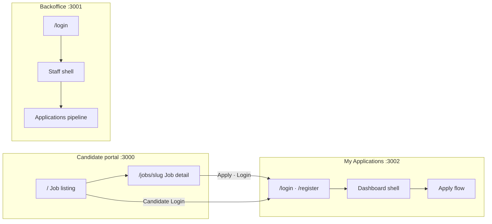
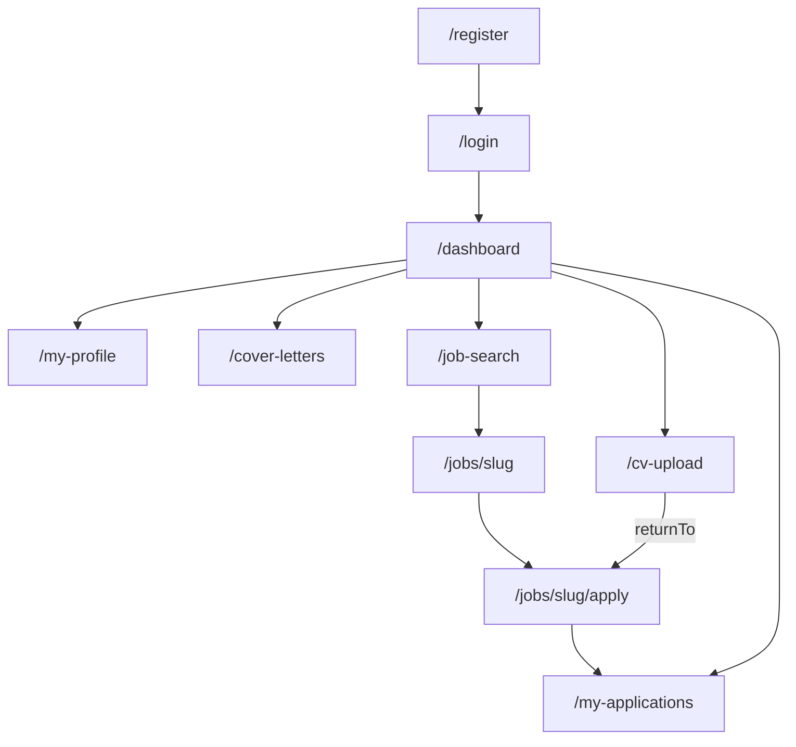
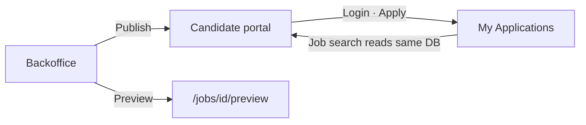

# TalentHub — Information Architecture

**Product:** TalentHub ATS  
**Date:** May 2026 · As-built  
**Ground truth:** App Router routes and navigation components in `apps/candidate-portal`, `apps/my-applications`, and `apps/backoffice`

This document describes **how the three candidate- and staff-facing web apps are organised**: primary navigation, route trees, secondary controls, and cross-app links. Use it for product planning, onboarding, portfolio case studies, and alignment with [PRD.md](specification/PRD.md).

---

## Platform overview

TalentHub splits hiring into **three Next.js apps** plus a central auth API. Each app has a distinct audience and navigation model.


| App                  | Port | Audience                            | Role                                                    |
| -------------------- | ---- | ----------------------------------- | ------------------------------------------------------- |
| **Candidate portal** | 3000 | Job seekers (anonymous)             | Public job discovery — browse, search, read job details |
| **My Applications**  | 3002 | Job seekers (signed in)             | Account, profile, CV, apply, track application status   |
| **Backoffice**       | 3001 | Recruiters, hiring managers, admins | Jobs, pipeline, candidates, interviews, administration  |
| **Central API**      | 4000 | Both audiences (server)             | Registration, login, OTP, password reset — no UI        |





### Responsibility split


| Capability                           | Candidate portal | My Applications        | Backoffice                          |
| ------------------------------------ | ---------------- | ---------------------- | ----------------------------------- |
| Browse published jobs                | Yes              | Yes (signed-in search) | No (staff job list only)            |
| Job detail                           | Yes              | Yes                    | Preview only (`/jobs/[id]/preview`) |
| Register / login                     | Redirect → MA    | Yes                    | Staff login only                    |
| Apply to job                         | Redirect → MA    | Yes                    | No                                  |
| CV / cover letter                    | No               | Yes                    | Download on application detail      |
| Application pipeline                 | No               | Status list only       | Full Kanban + table                 |
| Job posting CRUD                     | No               | No                     | Yes                                 |
| Lookup data (departments, skills, …) | No               | No                     | Administration                      |


---

## Shell models

Each app uses a different **chrome pattern** (header, sidebar, auth gate).

### Candidate portal — marketing shell

```text
┌─────────────────────────────────────────────────────────────┐
│  Skip link → #main-content                                  │
├─────────────────────────────────────────────────────────────┤
│  HEADER — Logo (/) · Candidate Login → My Applications      │
├─────────────────────────────────────────────────────────────┤
│  MAIN (#main-content)                                       │
│  · Hero / filters / job cards  OR  job detail sections      │
├─────────────────────────────────────────────────────────────┤
│  FOOTER — Privacy · Terms · Accessibility (placeholders)    │
└─────────────────────────────────────────────────────────────┘
```

- **No sidebar.** No session in this app.
- Header/footer mounted per page (not in root layout).
- `/login`, `/register`, `/dashboard` are **redirect stubs** → My Applications.

### My Applications — dashboard shell (signed in)

```text
┌─────────────────────────────────────────────────────────────┐
│  Skip link → #main-content                                  │
├──────────────┬──────────────────────────────────────────────┤
│  SIDEBAR     │  TOP BAR — product label · user menu         │
│  (primary)   ├──────────────────────────────────────────────┤
│              │  PAGE CONTENT (#main-content)                │
└──────────────┴──────────────────────────────────────────────┘
```


| Route group     | Routes               | Shell                             |
| --------------- | -------------------- | --------------------------------- |
| Public          | `/`, `/login`        | Minimal — no sidebar              |
| Public          | `/register`          | Site header + footer              |
| `(dashboard)/*` | All workspace routes | Sidebar + top bar (`MyAppsShell`) |


Session is enforced **client-side** in `DashboardRouteLayout` (Bearer JWT in browser storage). Unauthenticated access redirects to `/login`.

### Backoffice — staff dashboard shell

```text
┌─────────────────────────────────────────────────────────────┐
│  Skip link → #main-content                                  │
├──────────────┬──────────────────────────────────────────────┤
│  SIDEBAR     │  TOP BAR — session · user · logout           │
│  (primary)   ├──────────────────────────────────────────────┤
│              │  PAGE CONTENT (#main-content)                │
│              │  · kicker / H1 · secondary nav · surface     │
└──────────────┴──────────────────────────────────────────────┘
```


| Layout group    | Routes               | Sidebar                           |
| --------------- | -------------------- | --------------------------------- |
| `(auth)`        | `/login`             | Hidden — split auth layout        |
| `(dashboard)`   | All staff routes     | Visible — `BackOfficeShell`       |
| `(job-preview)` | `/jobs/[id]/preview` | Hidden — candidate-facing preview |


Session uses **httpOnly cookies** (`bo_access`) and server middleware on dashboard routes.

---

## 1. Candidate portal (`apps/candidate-portal` · :3000)

**Source:** `SiteHeader.tsx`, `SiteFooter.tsx`, `src/app/**/page.tsx`

### Primary navigation (header)


| Control          | Target                             | Notes                     |
| ---------------- | ---------------------------------- | ------------------------- |
| Logo “TalentHub” | `/`                                | In-app                    |
| Candidate Login  | `{MY_APPLICATIONS_BASE_URL}/login` | External link (port 3002) |


No main nav menu (Jobs, About, etc.). Footer links are placeholders (`href="#"` — see TH-192).

### Site map

```text
Candidate Portal (:3000)
│
├── /                              Job listing (home)
│   └── Query state only: q, department, location, employmentType,
│       experience, remote, postedWithin, sort, page
│
├── /jobs/[slug]                   Published job detail
│   └── (404) not-found UI         Invalid slug
│
├── /login                         → redirect My Applications /login
├── /register                      → redirect My Applications /register
└── /dashboard                     → redirect My Applications /dashboard
```

**Substantive pages:** 2 (`/`, `/jobs/[slug]`).  
**Redirect stubs:** 3 (legacy/bookmark URLs).

### In-page navigation


| Location              | Action           | Target                                                    |
| --------------------- | ---------------- | --------------------------------------------------------- |
| Job card              | View job         | `/jobs/{slug}`                                            |
| Job detail breadcrumb | All Jobs         | `/`                                                       |
| Job detail            | Apply / Continue | My Applications login (or apply when signed in elsewhere) |
| Pagination            | Prev / next page | `/?…&page=N` (filters preserved)                          |
| Filter empty state    | Clear filters    | `/`                                                       |
| Share                 | Copy/share URL   | `/jobs/{slug}`                                            |


### Filter state (virtual IA on `/`)

Filters are **URL search params**, not separate routes:


| Param            | Purpose                         |
| ---------------- | ------------------------------- |
| `q`              | Keyword search (title, summary) |
| `department`     | Department filter               |
| `location`       | Location filter                 |
| `employmentType` | Employment type                 |
| `experience`     | Experience level                |
| `remote`         | Remote roles                    |
| `postedWithin`   | `24h` · `7d` · `30d`            |
| `sort`           | `recent` · `az`                 |
| `page`           | Pagination                      |


---

## 2. My Applications (`apps/my-applications` · :3002)

**Source:** `MyAppsSidebar.tsx`, `DashboardRouteLayout.tsx`, `SiteHeader.tsx`

### Primary navigation (sidebar — signed in)

Order matches `MyAppsSidebar.tsx`:


| #   | Label           | href               | Active when                                    |
| --- | --------------- | ------------------ | ---------------------------------------------- |
| 1   | Dashboard       | `/dashboard`       | path starts with `/dashboard`                  |
| 2   | My Applications | `/my-applications` | path starts with `/my-applications`            |
| 3   | My Profile      | `/my-profile`      | path starts with `/my-profile`                 |
| 4   | Upload CV       | `/cv-upload`       | path starts with `/cv-upload`                  |
| 5   | Cover Letters   | `/cover-letters`   | path starts with `/cover-letters`              |
| 6   | Job search      | `/job-search`      | path starts with `/job` (includes `/jobs/...`) |


**Top bar:** mobile nav toggle · “TalentHub / My Applications” · user menu (Dashboard, Sign out).

**Register page header (logged out):** Log In → `/login` · Register → `/register`.

### Site map

```text
My Applications (:3002)
│
├── /                              → redirect /login
├── /login                         Sign in (standalone layout)
├── /register                      Create account (header + footer)
│
└── (dashboard)/                   [Sidebar + top bar — auth required]
    ├── /dashboard                 Onboarding journey · recent applications
    ├── /my-applications           Submitted applications · status list
    ├── /my-profile                Profile editor · import prototypes
    ├── /cv-upload                 CV library · upload · default CV
    │   └── ?returnTo=…            Return path after upload (e.g. apply)
    ├── /cover-letters             Cover letter library
    ├── /job-search                Published jobs (filters · pagination)
    └── /jobs/[slug]               Job detail · Apply CTA
        └── /jobs/[slug]/apply     4-step apply wizard
            Step 1 CV → 2 Cover letter → 3 Questions → 4 Review
```

### Key user flows




| Flow             | Path                                                  | Notes                                                     |
| ---------------- | ----------------------------------------------------- | --------------------------------------------------------- |
| **Onboarding**   | Dashboard journey cards                               | Links to CV → profile → cover letters → job search        |
| **Apply**        | `/job-search` → `/jobs/{slug}` → `/jobs/{slug}/apply` | CV required; redirects to `/cv-upload?returnTo=…` if none |
| **Track status** | `/my-applications`                                    | Links back to `/jobs/{slug}`                              |
| **Session**      | 15 min idle logout · token refresh                    | Client-side guard on `(dashboard)` routes                 |


### Secondary / in-page navigation


| Area                  | Control                  | Behaviour                                   |
| --------------------- | ------------------------ | ------------------------------------------- |
| Job search            | Filters, pagination      | URL params (similar to portal)              |
| Apply wizard          | Step indicator           | Linear 4 steps; back/next within wizard     |
| CV upload             | Continue with `returnTo` | Returns to apply flow after upload          |
| My applications empty | CTA                      | `/job-search`                               |
| User menu             | Profile                  | `#` placeholder — use sidebar `/my-profile` |


### Planned / gaps


| Item                 | Status           | Notes                               |
| -------------------- | ---------------- | ----------------------------------- |
| Saved jobs           | Planned (TH-054) | Dashboard placeholder; no route yet |
| Forgot password UI   | Partial (TH-043) | API exists; pages TBD               |
| Withdraw application | Planned (TH-055) | UI from candidate side TBD          |
| Time zone on profile | Partial (TH-056) | DB field; edit UI TBD               |


---

## 3. Backoffice (`apps/backoffice` · :3001)

**Source:** `Sidebar.tsx`, `AdministrationNav.tsx`, `maintenance-config.ts`  
**Detailed diagram:** [portfolio/information-architecture/backoffice-navigation-map.md](../portfolio/information-architecture/backoffice-navigation-map.md)

### Primary navigation (sidebar)

Order matches `Sidebar.tsx`:


| #   | Label          | href              | Active when                        | Status      |
| --- | -------------- | ----------------- | ---------------------------------- | ----------- |
| 1   | Dashboard      | `/`               | path === `/`                       | Done        |
| 2   | Applications   | `/applications`   | path starts with `/applications`   | Done        |
| 3   | Interviews     | `/interviews`     | path starts with `/interviews`     | Done        |
| 4   | Jobs           | `/jobs`           | path starts with `/jobs`           | Done        |
| 5   | Candidates     | `/candidates`     | path starts with `/candidates`     | Done        |
| 6   | Reports        | `/reports`        | path starts with `/reports`        | Placeholder |
| 7   | Administration | `/administration` | path starts with `/administration` | Done        |
| 8   | Settings       | `/settings`       | path starts with `/settings`       | Placeholder |


### Site map

```text
TalentHub Back Office (:3001)
│
├── /login                          [auth] Staff sign-in
│
├── /                               Dashboard — KPIs, pipeline health, activity
│
├── /applications                   Applications hub
│   ├── (view) Pipeline             Kanban · default · week scope · terminal tabs
│   ├── (view) Table                Sortable list · same URL
│   └── /applications/[id]          Application detail (packet page)
│       └── Modals: status · reject · reopen · schedule · cancel interview
│
├── /interviews                     Interview calendar
│
├── /jobs                           Job list (search · filters · pagination)
│   ├── /jobs/new                   Create job (multi-section form)
│   │   ├── /jobs/new/review        Pre-publish review
│   │   └── /jobs/new/success       Post-publish confirmation
│   └── /jobs/[id]/edit             Edit job
│
├── /jobs/[id]/preview              [job-preview layout] Candidate-facing preview
│
├── /candidates                     Summary dashboard
│   ├── /candidates/all             Searchable directory
│   ├── /candidates/[id]            Profile · CV history · applications
│   └── /candidates/[id]/edit       Account status edit
│
├── /administration                 → redirect /administration/departments
│   ├── /administration/companies
│   ├── /administration/departments
│   ├── /administration/locations
│   ├── /administration/employment-types
│   ├── /administration/experience-levels
│   ├── /administration/skills
│   ├── /administration/tags
│   └── /administration/benefits
│
├── /reports                        Placeholder (TH-165)
└── /settings                       Placeholder (TH-166)
```

### Secondary navigation (in-page)


| Area                      | Control          | Options / behaviour                                          |
| ------------------------- | ---------------- | ------------------------------------------------------------ |
| **Applications**          | View tablist     | Table view · Pipeline (default)                              |
| **Applications pipeline** | Week toolbar     | ← Prev week · Next week → · This week                        |
| **Applications pipeline** | Terminal tabs    | Rejected · Withdrawn                                         |
| **Applications pipeline** | Fullscreen       | Expands pipeline viewport                                    |
| **Applications pipeline** | Card menu        | Move to… (keyboard alternative to drag)                      |
| **Administration**        | Section select   | 8 lookup tables (see site map)                               |
| **Candidates**            | Tabs             | Summary (`/candidates`) · All Candidates (`/candidates/all`) |
| **Jobs list**             | Filters / search | Status, text search, pagination                              |


### Cross-links (context preservation)


| From               | Control                   | To                    | Note                           |
| ------------------ | ------------------------- | --------------------- | ------------------------------ |
| Applications table | Candidate name            | `/candidates/[id]`    | `?from=applications`           |
| Application detail | Applicant link            | `/candidates/[id]`    | `?from=applications`           |
| Application detail | Edit job                  | `/jobs/[id]/edit`     | —                              |
| Candidate detail   | Back                      | `/applications`       | When arrived from applications |
| Dashboard          | Pipeline health / insight | `/applications`       | Default pipeline view          |
| Jobs list          | Preview                   | `/jobs/[id]/preview`  | Separate layout, no sidebar    |
| Job success        | Actions                   | `/jobs` · `/jobs/new` | Post-publish                   |


---

## Cross-app navigation map

How users move between the three web apps:


| User action              | From                           | To                                               |
| ------------------------ | ------------------------------ | ------------------------------------------------ |
| Browse jobs (public)     | —                              | Candidate portal `/`                             |
| Read job (public)        | Portal `/jobs/{slug}`          | Same app                                         |
| Sign in / register       | Portal header or `/login` stub | My Applications                                  |
| Apply to job             | Portal job detail              | My Applications `/login` then apply flow         |
| Staff sign in            | —                              | Backoffice `/login`                              |
| Preview job as candidate | Backoffice jobs                | `/jobs/[id]/preview` (staff app, preview chrome) |


**Environment variable:** `NEXT_PUBLIC_MY_APPLICATIONS_BASE_URL` (default `http://localhost:3002`) — used by candidate portal for login and apply links.




Both candidate apps read **published jobs** from the shared database. Backoffice **publishes** jobs that appear on portal and My Applications job search.

---

## IA principles

1. **Separation of audiences** — Public browse (portal), authenticated candidate workspace (My Applications), and staff operations (backoffice) are separate apps with clear entry points.
2. **Application as staff unit of work** — Backoffice `/applications/[id]` is the adjudication anchor; candidate and job are linked hops, not parallel hierarchies.
3. **Throughput vs depth** — Pipeline and table for volume; detail pages for decisions; candidate profile when person-level history matters.
4. **Honest placeholders** — Reports, Settings, and footer legal links appear in nav or chrome but may surface “coming soon” or `#` until shipped (TH-165, TH-166, TH-192).
5. **URL-driven discovery state** — Job filters and search on portal and My Applications use query params so results are shareable and bookmarkable.
6. **Time-scoped pipeline** — Backoffice pipeline week navigation reduces noise; table view remains all-time.
7. **Administration as reference data** — Lookup tables grouped under one nav item with in-page section picker, not eight top-level items.

---

## Route counts (summary)


| App              | Page routes                           | Auth model                    | Primary nav items |
| ---------------- | ------------------------------------- | ----------------------------- | ----------------- |
| Candidate portal | 5 files (2 substantive + 3 redirects) | None                          | 1 header CTA      |
| My Applications  | 11 pages                              | Client JWT + dashboard layout | 6 sidebar items   |
| Backoffice       | 19 pages                              | httpOnly cookie + middleware  | 8 sidebar items   |


---

## Related documentation


| Document                                                                                                   | Purpose                                    |
| ---------------------------------------------------------------------------------------------------------- | ------------------------------------------ |
| [PRD.md](specification/PRD.md)                                                                             | Functional requirements and user journeys  |
| [PROJECT_STRUCTURE.md](PROJECT_STRUCTURE.md)                                                               | Monorepo layout and ports                  |
| [FEATURE_BACKLOG.md](specification/FEATURE_BACKLOG.md)                                                     | Feature codes and open IA-related work     |
| [portfolio/information-architecture/](../portfolio/information-architecture/README.md)                     | Backoffice navigation map (Mermaid + PNG)  |
| [portfolio/wireframes/](../portfolio/wireframes/README.md)                                                 | Lo-fi screen wireframes for all three apps |
| [ATS_Application_State_UI_API_Requirements.md](specification/ATS_Application_State_UI_API_Requirements.md) | Pipeline statuses and transitions          |


---

*Information architecture v1.0 · May 2026 · Derived from as-built Next.js routes and navigation components.*