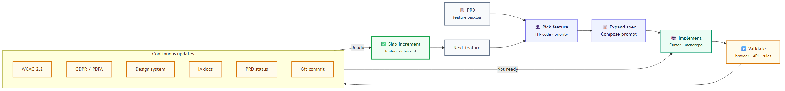
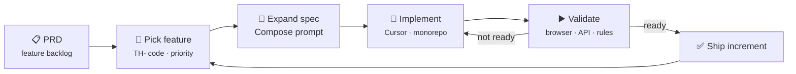

# Case Study: AI Assisted Designing and Implementation of an Applicant Tracking System (ATS)

**Role:** Product Designer  
**Project:** TalentHub ATS — multi-app hiring platform (`ats-platform` monorepo)  
**Timeline:** *[Add your dates]*  
**Tools:** Cursor IDE, ChatGPT, Claude Code, VSCode  
**Ground truth:** [PRD](../docs/specification/PRD.md) · [Feature backlog](../docs/specification/FEATURE_BACKLOG.md)

---

## Executive Summary

Building a modern Applicant Tracking System (ATS) requires balancing complex compliance mandates, multifaceted user workflows, and robust engineering architecture. To optimize the traditional product lifecycle, this project utilized a **hybrid development model**—seamlessly pairing human-centered UX design methodologies with targeted AI assistance.


*Full diagram spec:* [process-diagrams/ats-ai-development-process.md](process-diagrams/ats-ai-development-process.md)

---

## The 5-Stage Product Development Lifecycle

### 1. Discovery Stage: Problem Framing & Insight Generation

The foundational phase centered on grounding the system’s use case in verifiable market and user needs, eliminating assumptions before defining specifications.

* **Problem Framing & Use Case Identification:** Established the core value proposition of the ATS, defining exactly how it solves recruitment inefficiencies (e.g., resume parsing bottlenecks, high time-to-hire metrics).
* **Competitor Analysis:** Benchmarked existing enterprise and mid-market ATS platforms to map industry standards, pinpointing critical feature gaps and user experience friction points.
* **Netnographic Research:** Conducted qualitative digital ethnography across recruiter communities, forums, and professional networks to extract raw, unbiased pain points regarding current hiring tools.

**Discovery artefacts (repo)**

| Artefact | Link |
|----------|------|
| Netnographic research (full) | [product-designer-ats-backoffice/17-netnographic-ats-research.md](product-designer-ats-backoffice/17-netnographic-ats-research.md) |
| Market research summary (case study insert) | [product-designer-ats-backoffice/18-market-research-summary.md](product-designer-ats-backoffice/18-market-research-summary.md) |
| Slide-ready deck content | [product-designer-ats-backoffice/19-netnographic-deck-slides.md](product-designer-ats-backoffice/19-netnographic-deck-slides.md) |
| Problem framing & role | [product-designer-ats-backoffice/01-problem-framing-and-role.md](product-designer-ats-backoffice/01-problem-framing-and-role.md) |

`[Screenshot: Discovery synthesis]` — *Replace with your FigJam board, persona blocks, or competitor feature matrix. Suggested exports: pain-point clusters from §5–§7 of the netnographic doc, or slides 3–6 from the deck content file.*

---

### 2. Define Scope, Specification & Design

Transitioning from insights to execution, this stage focused on building a rock-solid, multi-layered specification map. AI was heavily leveraged here to draft documentation and baseline code, which was then manually audited and refined by engineering and design leads.

* **PRD Creation & Validation:** Initial product requirements documents were synthesized via generative AI models based on discovery data, followed by strict internal review rounds to lock down product logic.
* **Technical & Architecture Decisions:** Finalized a highly maintainable dev stack (AI-assisted stack evaluation) and made foundational architectural decisions, selecting a mono-repo structure to support modularity.
* **Compliance & Inclusivity Engineering:** Drafted stringent design specifications mapped directly to **WCAG 2.2 accessibility guidelines** and localized data protection mandates (**GDPR and PDPA**).
* **Base Design System & Component Library:** Generated production-ready sample layouts and foundational markup libraries through AI code-generation tools, accelerating the creation of a responsive, scalable design system.

**Specification & design artefacts (repo)**

| Artefact | Link |
|----------|------|
| Product requirements (as-built) | [docs/specification/PRD.md](../docs/specification/PRD.md) |
| Feature backlog (123 TH codes) | [docs/specification/FEATURE_BACKLOG.md](../docs/specification/FEATURE_BACKLOG.md) |
| Backoffice information architecture | [information-architecture/backoffice-navigation-map.md](information-architecture/backoffice-navigation-map.md) |
| Design system catalog (HTML) | [docs/design-system/index.html](../docs/design-system/index.html) |
| Lo-fi wireframes (6 screens) | [wireframes/README.md](wireframes/README.md) |


`[Screenshot: Design system]` — *Replace with a side-by-side of your Figma component library next to code tokens. Interim substitute: open the [design system catalog](../docs/design-system/index.html) in a browser and capture components + [wireframe PNGs](wireframes/png/).*

---

### 3. Implementation: Incremental, Prompt-Driven Cycles

Rather than an unpredictable, monolithic build, development was broken down into agile, highly controlled micro-increments driven directly by the validated PRD.

* **The Feature Loop:** For every isolated feature, the workflow followed a strict sequential pipeline:

$$\text{Review PRD} \longrightarrow \text{Isolate Feature Segment} \longrightarrow \text{Compose AI Prompt/Spec} \longrightarrow \text{Implement Code}$$



*Diagram source:* [process-diagrams/ats-feature-increment-loop.mmd](process-diagrams/ats-feature-increment-loop.mmd)



**Prompt library:** [docs/specification/FEATURE_BACKLOG_CURSOR_PROMPTS.md](../docs/specification/FEATURE_BACKLOG_CURSOR_PROMPTS.md) — one user story per TH feature code.

---

### 4. Validation & Updates: The Quality Gate

To balance the speed of AI-assisted generation, Stage 4 acted as a strict compliance and quality gate. Every deployed feature was immediately benchmarked against its original functional and legal intent.

* **Compliance Audits:** Conducted rigorous, recurring automated and manual audits for WCAG 2.2 web accessibility and international data privacy laws (GDPR/PDPA).
* **System Component Syncing:** Continuously updated the central UI design system and information architecture (IA) documentation as new edge-case components emerged during building.
* **Repository & Documentation Control:** Standardized systematic status updates back to the PRD while executing atomic commits to the Git version control repository.

**WCAG 2.2 audit — executive summary (rev 1.1 · May 2026)**

| Result | Count |
|--------|-------|
| Pass | 34 |
| Fail | 17 |
| Partial / warning | 15 |
| Not applicable | 4 |

Full report: [docs/reports/wcag22-audit.md](../docs/reports/wcag22-audit.md) · Remediation: **TH-190**, **TH-191**, **TH-192**

**GDPR / PDPA audit — executive summary (rev 1.1 · May 2026)**

| Severity | Count |
|----------|-------|
| Critical | 6 |
| High | 7 |
| Medium | 6 |
| Informational | 5 |

Full report: [docs/reports/pdpa-gdpr-audit.md](../docs/reports/pdpa-gdpr-audit.md) · Remediation: **TH-009**, **TH-130–131**, **TH-192**, **TH-193**

**Implementation alignment:** [docs/reports/implementation-alignment-2026.md](../docs/reports/implementation-alignment-2026.md)

`[Screenshot: Compliance / audit checklist]` — *Replace with a PR screenshot, axe/Lighthouse run, or exported Pass/Fail table from the audit docs above.*

---

### 5. Ship & Iterate

Once an increment cleared all validation gates, the feature was officially pushed to production.

* **Continuous Feedback Loop:** Shipping was treated not as an endpoint, but as a transition. Deployed features instantly opened up user feedback channels, routing behavioral data and real-world system performance metrics directly back into **Stage 1 (Discovery)** to fuel the next iterative build.

```
Discovery → Define → Implement → Validate → Ship
     ↑__________________________________________|
              (next increment / feedback)
```

**Shipped platform (as-built)**

| App | Port | Purpose |
|-----|------|---------|
| Candidate portal | 3000 | Public job discovery |
| My Applications | 3002 | Register, CV, apply, track status |
| Backoffice | 3001 | Staff hiring workflows |
| Central API | 4000 | Auth + candidate services |

Run locally: `npm run dev:all` from repo root.

---

## Related portfolio pack

Deeper backoffice-focused case study and appendix files: [product-designer-ats-backoffice/README.md](product-designer-ats-backoffice/README.md)

| File | Purpose |
|------|---------|
| [NOTION_CASE_STUDY.md](product-designer-ats-backoffice/NOTION_CASE_STUDY.md) | Staff applications workflow — Notion-ready narrative |
| [16-ai-workflow-process-diagram.md](product-designer-ats-backoffice/16-ai-workflow-process-diagram.md) | Process diagrams + Mermaid source blocks |
| [15-ai-workflow-design-and-development.md](product-designer-ats-backoffice/15-ai-workflow-design-and-development.md) | Human vs AI responsibilities |

---

*Last updated: May 2026*
