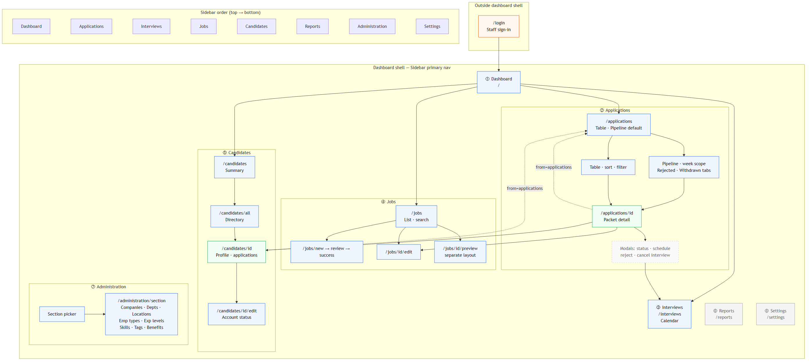

# Backoffice — Information architecture & navigation map

**App:** `apps/backoffice` · port **3001**  
**Date:** May 2026 · As-built  
**Source:** `Sidebar.tsx`, App Router routes, [PRD §5.3–§5.9](../../docs/specification/PRD.md)

This document maps **primary navigation**, **secondary navigation**, and **cross-app links** for the TalentHub staff portal.

---

## Shell model

```text
┌─────────────────────────────────────────────────────────────┐
│  Skip link → #main-content                                  │
├──────────────┬──────────────────────────────────────────────┤
│  SIDEBAR     │  TOP BAR (session / user / logout)           │
│  (primary)   ├──────────────────────────────────────────────┤
│              │  PAGE CONTENT (#main-content)                │
│              │  · page title / kicker                       │
│              │  · secondary nav (tabs, admin section)       │
│              │  · main surface                              │
└──────────────┴──────────────────────────────────────────────┘
```

| Layout group | Routes | Sidebar |
|--------------|--------|---------|
| `(auth)` | `/login` | Hidden — split auth layout |
| `(dashboard)` | All staff app pages below | Visible — `BackOfficeShell` |
| `(job-preview)` | `/jobs/[id]/preview` | Hidden — candidate-facing preview chrome |

---

## Primary navigation (sidebar)

Order matches `Sidebar.tsx` (implementation).

| # | Label | href | Active when | Status |
|---|--------|------|-------------|--------|
| 1 | Dashboard | `/` | path === `/` | Done |
| 2 | Applications | `/applications` | path starts with `/applications` | Done |
| 3 | Interviews | `/interviews` | path starts with `/interviews` | Done |
| 4 | Jobs | `/jobs` | path starts with `/jobs` (excl. preview layout*) | Done |
| 5 | Candidates | `/candidates` | path starts with `/candidates` | Done |
| 6 | Reports | `/reports` | path starts with `/reports` | Placeholder |
| 7 | Administration | `/administration` | path starts with `/administration` | Done |
| 8 | Settings | `/settings` | path starts with `/settings` | Placeholder |

\* Job preview uses `(job-preview)` layout without dashboard sidebar.

---

## Site map (full tree)

```text
TalentHub Back Office (:3001)
│
├── /login                          [auth] Staff sign-in
│
├── /                               Dashboard — KPIs, pipeline health, activity, insights
│
├── /applications                   Applications hub
│   ├── (default) Pipeline view     Kanban · week scope · terminal tabs
│   ├── (tab) Table view            Sortable list · same URL
│   └── /applications/[id]          Application detail (packet page)
│       └── (modal) Schedule interview
│       └── (modal) Status / reject / reopen / cancel interview
│
├── /interviews                     Interview calendar
│
├── /jobs                           Job list (search · filters · pagination)
│   ├── /jobs/new                   Create job (multi-section form)
│   │   ├── /jobs/new/review        Pre-publish review
│   │   └── /jobs/new/success       Post-publish confirmation
│   └── /jobs/[id]/edit             Edit published/draft job
│
├── /jobs/[id]/preview              [job-preview layout] Candidate-facing preview
│
├── /candidates                     Summary dashboard
│   ├── /candidates/all             Searchable directory table
│   ├── /candidates/[id]            Profile · CV history · applications
│   └── /candidates/[id]/edit       Account status edit
│
├── /administration                 → redirects to /administration/departments
│   ├── /administration/companies
│   ├── /administration/departments
│   ├── /administration/locations
│   ├── /administration/employment-types
│   ├── /administration/experience-levels
│   ├── /administration/skills
│   ├── /administration/tags
│   └── /administration/benefits
│
├── /reports                        Placeholder — analytics TBD
└── /settings                       Placeholder — workspace config TBD
```

---

## Secondary navigation (in-page)

| Area | Control | Options / targets |
|------|---------|-------------------|
| **Applications** | View tablist | Table view · Pipeline (default) |
| **Applications pipeline** | Week toolbar | ← Prev week · Next week → · This week |
| **Applications pipeline** | Terminal tabs | Rejected · Withdrawn |
| **Applications pipeline** | Fullscreen | Expands pipeline viewport |
| **Applications pipeline** | Card menu | Move to… (keyboard alternative to drag) |
| **Administration** | Section `<select>` | Companies, Departments, Locations, Employment types, Experience levels, Skills, Tags, Benefits |
| **Jobs list** | Filters / search | Status, text search, pagination |
| **Candidates** | Summary → All | `/candidates` ↔ `/candidates/all` |

---

## Navigation diagram (Mermaid)

See [backoffice-navigation-map.mmd](./backoffice-navigation-map.mmd) · exported PNG: [backoffice-navigation-map.png](./backoffice-navigation-map.png).



---

## Cross-link map (context preservation)

| From | Control | To | Query / note |
|------|---------|-----|----------------|
| Applications table | Candidate name | `/candidates/[id]` | `?from=applications` |
| Applications table | Job / row | `/applications/[id]` | — |
| Pipeline card | Card click | `/applications/[id]` | Drag guard prevents mis-click |
| Application detail | Applicant link | `/candidates/[id]` | `?from=applications` |
| Application detail | Edit job | `/jobs/[id]/edit` | — |
| Application detail | Schedule interview | Modal → saves → calendar | `/interviews` |
| Candidate detail | Back (when from apps) | `/applications` | When `from=applications` |
| Dashboard | Recent activity | Application / job detail | Contextual deep link |
| Dashboard | Pipeline health CTA | `/applications` | Pipeline default |
| Dashboard | Curator insight | `/applications` | Stalled interviews |
| Jobs list | Preview | `/jobs/[id]/preview` | New tab / separate layout |
| Job success | View listing / create another | `/jobs` · `/jobs/new` | Post-publish |

---

## IA principles (backoffice)

1. **Application as unit of work** — `/applications/[id]` is the adjudication anchor; candidate and job are linked hops.
2. **Throughput vs depth** — `/applications` (breadth) → detail (depth); `/candidates/[id]` when person history matters.
3. **Time cohort** — Pipeline week scope reduces noise; not duplicated in table (all-time list).
4. **Honest placeholders** — Reports and Settings appear in nav but surface “coming soon” until TH-165/166.
5. **Administration as reference data** — Secondary section picker, not top-level clutter for each lookup table.

---

## Related artefacts

| Document | Purpose |
|----------|---------|
| [14-screen-and-route-inventory.md](../product-designer-ats-backoffice/14-screen-and-route-inventory.md) | Route file inventory |
| [04-information-architecture.md](../product-designer-ats-backoffice/04-information-architecture.md) | Platform-wide IA (all apps) |
| [wireframes/](../wireframes/README.md) | Lo-fi screen wireframes |
| [PRD §5.3–§5.9](../../docs/specification/PRD.md) | Functional requirements |

---

*IA map v1.0 · May 2026*
