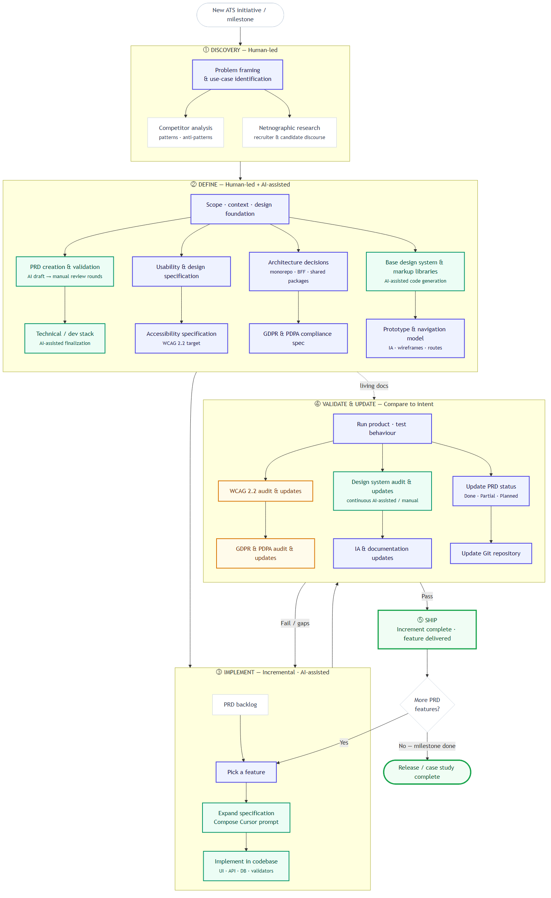
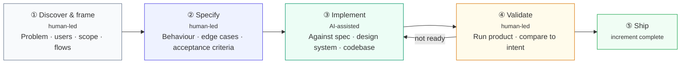
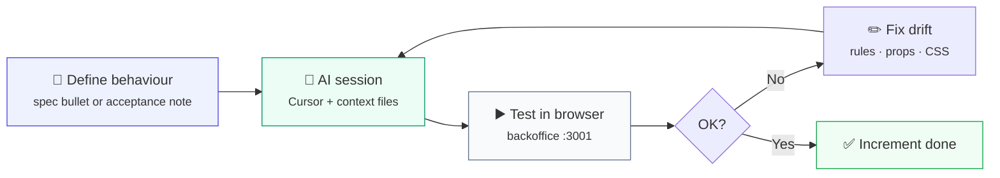
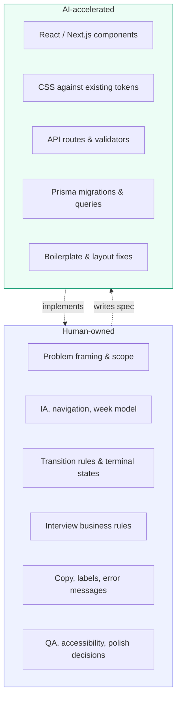
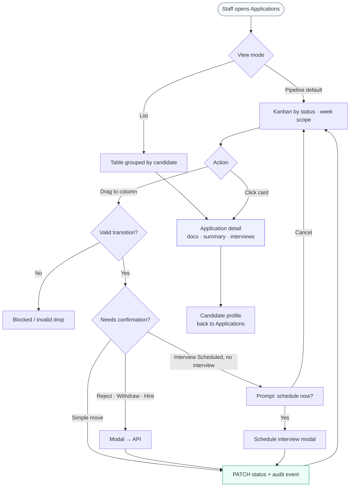

# AI-assisted design & development — process flow

**Full 5-stage process (Discovery → Ship):** [portfolio/process-diagrams/ats-ai-development-process.md](../process-diagrams/ats-ai-development-process.md)

**Feature increment loop (inset):** [PNG](../process-diagrams/ats-feature-increment-loop.png)

## PNG downloads

Pre-rendered files are in **`diagrams/`**:

| PNG | Use for |
|-----|---------|
| [diagrams/01-hero-end-to-end.png](./diagrams/01-hero-end-to-end.png) | Portfolio hero / case study header |
| [diagrams/02-iteration-loop.png](./diagrams/02-iteration-loop.png) | Inset: how one increment ships |
| [diagrams/03-human-vs-ai.png](./diagrams/03-human-vs-ai.png) | Human vs AI responsibilities |
| [diagrams/04-product-user-flow.png](./diagrams/04-product-user-flow.png) | Optional: generic user journey |

Copy the Mermaid blocks below into **Notion** (Mermaid block), **GitHub**, **Obsidian**, or re-export from [mermaid.live](https://mermaid.live).

---

## 1. End-to-end process (portfolio hero diagram)

Generic workflow for **any backlog item** — not tied to a single screen or feature.

---

## 2. Single iteration loop (how one feature shipped)

Use this under the hero diagram to explain *how you worked day-to-day*.

---

## 3. What stayed human vs AI-assisted

---

## 4. Product flow (what recruiters experience — optional second page)

Shows you designed for *users*, not only process.

---

## Caption text (paste under the diagram)

**Figure 1 — AI-assisted delivery process (per backlog item).** Discovery and specification stay human-led so behaviour and edge cases are explicit before implementation. AI accelerates build against written requirements and the existing design system; each increment is validated in a running product before ship. The loop applies to every feature the same way—product judgment and QA remain human-owned.

---

## Export tips

| Tool | How |
|------|-----|
| **mermaid.live** | Paste diagram → Export PNG/SVG |
| **Notion** | `/code` → Mermaid → paste block 1 or 2 |
| **Figma** | Export PNG and place on portfolio frame |
| **GitHub README** | Mermaid renders in markdown automatically |
